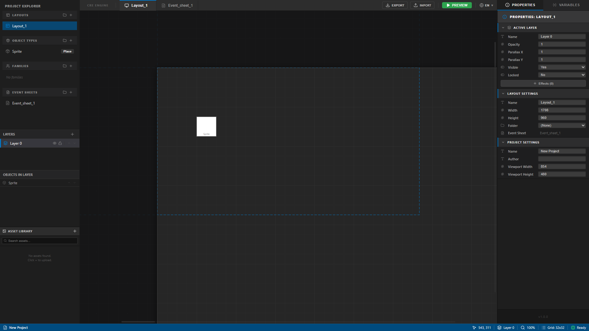

<div align="center">

# 🎮 Construct-RE

### A browser-based 2D game editor inspired by Construct 3

[](https://www.typescriptlang.org/)
[](https://react.dev/)
[](https://vitejs.dev/)
[](LICENSE)

<br/>



<br/>

> **Construct-RE** is an open-source, modular 2D game editor that runs entirely in the browser.  
> Build scenes, place objects, define behaviors, and write event-driven logic — all without leaving your browser.

</div>

---

## ✨ Features

| Feature | Status |
|---|---|
| 🗂 **Project Explorer** — Layouts, Object Types, Event Sheets | ✅ |
| 🖼 **Visual Scene Viewport** — Pan, zoom, drag & drop placement | ✅ |
| 🧱 **Layer System** — Visibility, lock, opacity, draw order | ✅ |
| 🔍 **Properties Inspector** — Per-instance & per-layout settings | ✅ |
| 📋 **Event Sheet** — Condition/Action logic model | ✅ |
| 🌐 **i18n Support** — Multilingual interface | ✅ |
| 💾 **Export / Import** — JSON-based project format | ✅ |
| ▶️ **Preview Runtime** — Run your game in the browser | 🚧 |
| 🖼 **Asset Library** — Sprites and image management | 🚧 |
| 🧩 **Plugin / Behavior System** | 🔜 |

---

## 🏗 Architecture

The project is organized into clean, separated layers:

```
src/
├── model/          # Project schema — layouts, layers, object types, instances, events
├── editor/         # Editor-only state — selection, tools, viewport interaction
├── runtime/        # Game runtime — runs the project in the browser
├── ui/             # React components — panels, inspector, toolbar, event sheet
├── serialization/  # Save / load / schema migrations
├── store/          # Zustand global state
├── i18n/           # Localization strings
└── utils/          # Shared helpers
```

**Stack:** React 19 · TypeScript 6 · Vite 8 · Zustand · Matter.js · Vitest

---

## 🚀 Getting Started

### Prerequisites

- [Node.js](https://nodejs.org/) ≥ 18
- [pnpm](https://pnpm.io/) (recommended)

### Installation

```bash
# Clone the repository
git clone https://github.com/Dzangiev/Contsruct-RE.git
cd Contsruct-RE

# Install dependencies
pnpm install

# Start the development server
pnpm dev
```

Open [http://localhost:5173](http://localhost:5173) in your browser.

### Other commands

```bash
pnpm test       # Run unit tests (Vitest)
pnpm build      # Build for production
pnpm preview    # Preview production build
```

---

## 🎯 Project Goals

Construct-RE is **not** a clone of Construct 3. It is a clean-room, open-source reimplementation of the *ideas* behind visual 2D game editors:

- A **modular, extensible** architecture anyone can contribute to
- A **serializable JSON** project format with versioned migrations
- A **runtime preview** that runs the game logic directly in the browser
- An **event-driven logic system** similar to Construct's condition/action model

---

## 🤝 Contributing

Contributions are welcome! Please:

1. Fork the repository
2. Create a feature branch: `git checkout -b feature/my-feature`
3. Commit your changes with a clear message
4. Open a Pull Request

---

## 📄 License

This project is licensed under the MIT License — see the [LICENSE](LICENSE) file for details.

---

<div align="center">

Made with ❤️ and TypeScript

</div>
